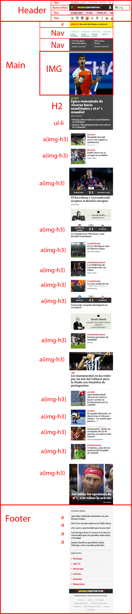

# Procesverslag
Markdown is een simpele manier om HTML te schrijven.  
Markdown cheat cheet: [Hulp bij het schrijven van Markdown](https://github.com/adam-p/markdown-here/wiki/Markdown-Cheatsheet).

Nb. De standaardstructuur en de spartaanse opmaak van de README.md zijn helemaal prima. Het gaat om de inhoud van je procesverslag. Besteedt de tijd voor pracht en praal aan je website.

Nb. Door *open* toe te voegen aan een *details* element kun je deze standaard open zetten. Fijn om dat steeds voor de relevante stuk(ken) te doen.

## Jij

  
uitwerken voor kick-off werkgroep

  ### Auteur:
  Nikolai

  #### Je startniveau:
  Blauw

  #### Je focus:
  Surface plane
 

## Je website

  
uitwerken voor kick-off werkgroep

  ### Je opdracht:
  https://www.mundodeportivo.com/

  #### Screenshot(s) van de eerste pagina (small screen): 
  hier de naam van de pagina  
  

  #### Screenshot(s) van de tweede pagina (small screen):
  hier de naam van de pagina  
  
 

## Toegankelijkheidstest 1/2 (week 1)

  
uitwerken na test in 1e werkgroep

  ### Bevindingen
  Lijst met je bevindingen die in de test naar voren kwamen:

  #### Screenreader
Geen opmerkingen.

  #### Muis en Toetsenbord 
Moeilijk maar niet onmogelijk om met het toetsenbord te navigeren. Het is een pagina bedoeld voor kijken en kliken.

  #### Motoriek (shocks, elastiekjes)
Moeijlijk om uberhaupt iets te doen met een schuddende arm.

  #### Visueel (brillen, contrast, kleurenblind, dark/light). 
De kleuren zijn niet nodig om de pagina en de inhoud te begrijpen. 

## Breakdownschets (week 1)

  
uitwerken na afloop 2e werkgroep

  ### de hele pagina: 
  

  ### dynamisch deel (bijv menu): 
  

  ### wellicht nog een dynamisch deel (bijv filter): 
  

## Voortgang 1 (week 2)

  
uitwerken voor 1e voortgang

  ### Stand van zaken
  Ik weet niet hoe ik de scorebord moet namaken.

  ### Agenda voor meeting  (ontbreekt)
  samen met je groepje opstellen

  | student 1      | student 2          | student 3    | student 4        |
  | ---            | ---                | ---          | ---              |
  | dit bespreken  | en dit             | en ik dit    | en dan ik dat    |
  | en dat ook nog | dit als er tijd is | nog een punt | dit wil ik zeker |
  | ...            | ...                | ...          | ...              |

  ### Verslag van meeting
  hier na afloop snel de uitkomsten van de meeting vastleggen

  - H1 moet niet in header zijn normaal gesprokken.
  - Minder navigatie menus namaken van echte site.
  - nog een punt
  - ...

## Voortgang 2 (week 3)

  
Ik heb sinds vorige week verder gewerkt aan mijn html en css. Ook heb ik jscript gebruikt om een burger menu te maken.

  ### Stand van zaken
  hier dit ging goed & dit was lastig (neem ook screenshots op van delen van je website en code)

  ### Agenda voor meeting  (ontbreekt)
  samen met je groepje opstellen

  | student 1      | student 2          | student 3    | student 4        |
  | ---            | ---                | ---          | ---              |
  | dit bespreken  | en dit             | en ik dit    | en dan ik dat    |
  | en dat ook nog | dit als er tijd is | nog een punt | dit wil ik zeker |
  | ...            | ...                | ...          | ...              |

- Ian wil besprekken over de structuur van zijn menu en wat hulp met zijn css.

- Ik wil weten hoe ik de font kan gebruiken.

- Ik wil ook weten hoe ik de knop van het hamburger menu kan laten veranderen.

  ### Verslag van meeting
  hier na afloop snel de uitkomsten van de meeting vastleggen

  - Ik moet verslagen van voortgangen maken.
  - Ik weet hoe je een font in je css importeert. Bij een font 400 en 700 in beide italic en normal gebruiken.
  - 
- ...

## Toegankelijkheidstest 2/2 (week 4) (ontbreekt)

  
uitwerken na test in 8e werkgroep

  ### Bevindingen
  Lijst met je bevindingen die in de test naar voren kwamen (geef ook aan wat er verbeterd is):

  #### Screenreader
  Door te zorgen dat er gemakkelijk kan genavigeerd worden door de kopjes en linkjes.

  #### Muis en Toetsenbord 
  Button states toegevoegd (hover,focus)
  Skip naar inhoud knop toevoegen.

  #### Motoriek (shocks, elastiekjes)
  Niet toegepast.

  #### Visueel (brillen, contrast, kleurenblind, dark/light). 
  Niet toegepast.

## Voortgang 3 (week 4)

  
uitwerken voor 3e voortgang

  ### Stand van zaken
  Ik wil weten hoe ik sommige elementen van mijn html moet stijlen.

  ### Agenda voor meeting
  samen met je groepje opstellen

  | student 1      | student 2          | student 3    | student 4        |
  | ---            | ---                | ---          | ---              |
  | dit bespreken  | en dit             | en ik dit    | en dan ik dat    |
  | en dat ook nog | dit als er tijd is | nog een punt | dit wil ik zeker |
  | ...            | ...                | ...          | ...              |

  ### Verslag van meeting
  hier na afloop snel de uitkomsten van de meeting vastleggen

  - Ervoor zorgen dat ik de surface plane elementen toe voeg.
  - Ervoor zorgen dat ik de toegankelijkheids test doe.
  - nog een punt
  - ...

## Eindgesprek (week 5)

  
uitwerken voor eindgesprek

  ### Je uitkomst - karakteristiek screenshots:
  

  ### Dit ging goed/Heb ik geleerd: 
  Ik heb geleerd hoe een dark mode/ light mode toggle knop maakt. Ook hoe ik letter grote kan aanpassen bij de hele body 
  met enkel een knop en hoe je en link maakt die een sectie kan overslaan.

  

  ### Dit was lastig/Is niet gelukt:
  Het scorebord was niet helemaal gelukt zoals gewenst. De iconen van de teams staan niet helemaal op de juiste
  positie. 

  

## Bronnenlijst

  
continu bijhouden terwijl je werkt

  Nb. Wees specifiek ('css-tricks' als bron is bijv. niet specifiek genoeg).

  1. bron 1
  2. bron 2
  3. ...

